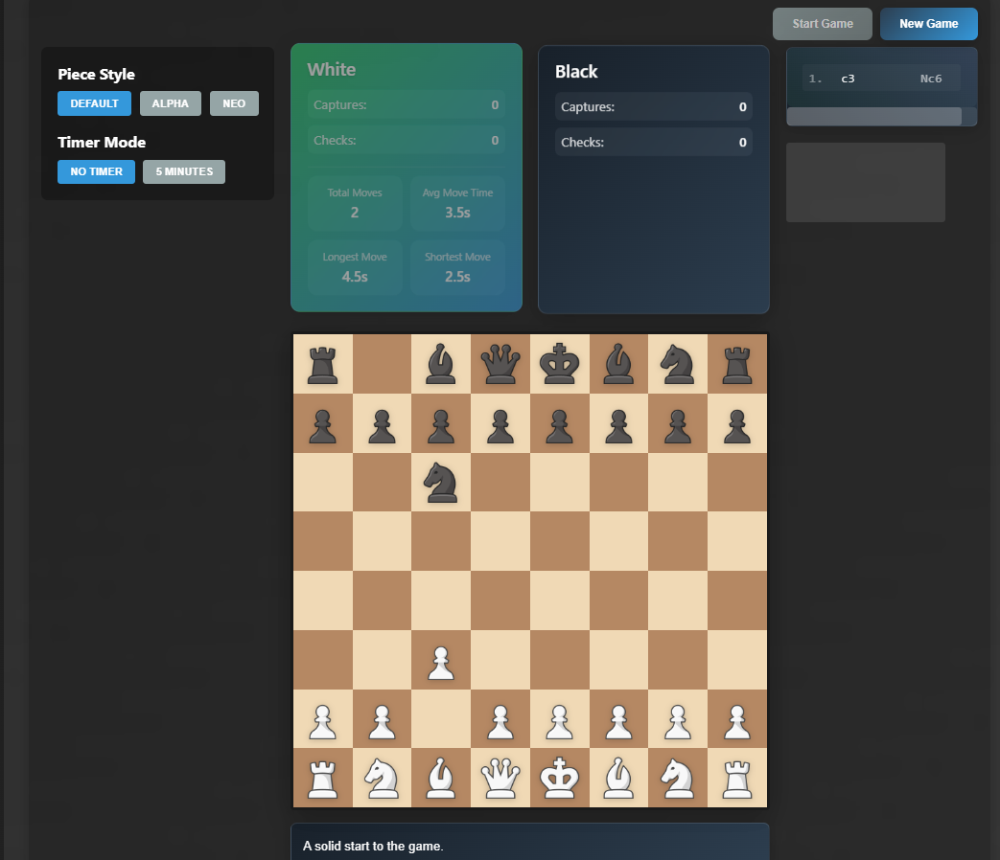

# Modern Chess Game

A feature-rich, modern chess game built with React and TypeScript, featuring an AI opponent, timer functionality, and beautiful animations.



## Features

### Gameplay
- Play against an AI opponent
- Timer mode with 5-minute time control
- Move validation and game state tracking
- Automatic game end detection (checkmate, stalemate, time expiration)

### Visual Design
- Modern, responsive UI with smooth animations
- Beautiful piece movements and capture effects
- Dynamic game status display
- Interactive player stats with hover effects
- Floating animations for active elements

### Player Experience
- Real-time move history
- Captured pieces display
- Enhanced game statistics
- Smooth transitions and hover effects
- Responsive design for all screen sizes

### Technical Features
- TypeScript for type safety
- React with modern hooks
- Styled-components for styling
- Efficient state management
- Optimized performance

## Getting Started

### Prerequisites
- Node.js (v14 or higher)
- npm or yarn

### Installation

1. Clone the repository:
```bash
git clone https://github.com/yourusername/chessgame.git
cd chessgame
```

2. Install dependencies:
```bash
npm install
# or
yarn install
```

3. Start the development server:
```bash
npm start
# or
yarn start
```

The application will open in your default browser at `http://localhost:3000`.

## Game Controls

- Click on a piece to select it
- Click on a highlighted square to move
- Use the "Start Game" button to begin
- Use the "New Game" button to reset
- Timer mode can be toggled before starting the game

## Game Features

### Timer Mode
- 5-minute time control for each player
- Automatic game end when time expires
- Visual timer display with warning states

### AI Opponent
- Smart move evaluation
- Adaptive difficulty
- Realistic thinking time simulation

### Statistics
- Move count
- Capture tracking
- Check counting
- Average move time
- Longest and shortest moves
- Piece activity tracking

## Development

### Project Structure
```
src/
  ├── components/     # React components
  ├── services/       # Game logic and AI
  ├── types/          # TypeScript type definitions
  ├── config/         # Game configuration
  └── styles/         # Global styles
```

### Available Scripts

- `npm start` - Runs the app in development mode
- `npm test` - Launches the test runner
- `npm run build` - Builds the app for production
- `npm run eject` - Ejects from Create React App

## Contributing

1. Fork the repository
2. Create your feature branch (`git checkout -b feature/AmazingFeature`)
3. Commit your changes (`git commit -m 'Add some AmazingFeature'`)
4. Push to the branch (`git push origin feature/AmazingFeature`)
5. Open a Pull Request

## License

This project is licensed under the MIT License - see the [LICENSE](LICENSE) file for details.

## Acknowledgments

- Chess.js for game logic
- React for the UI framework
- Styled-components for styling
- TypeScript for type safety
